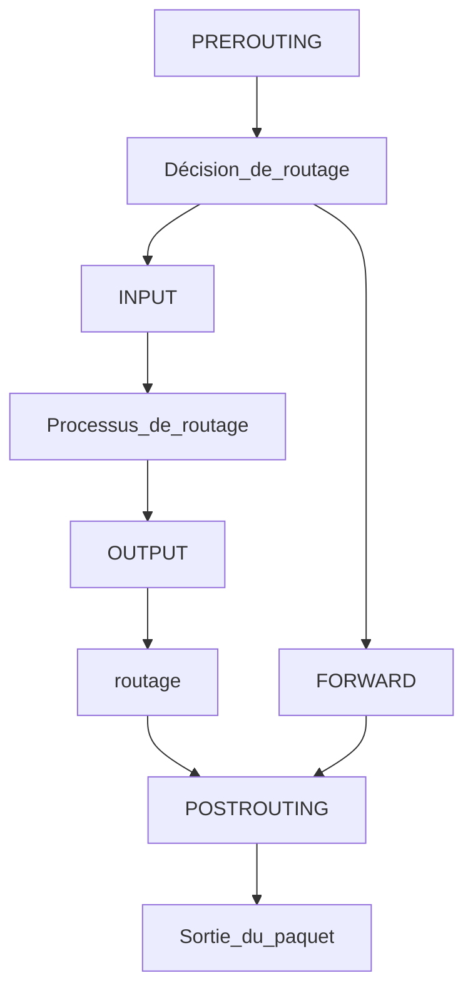
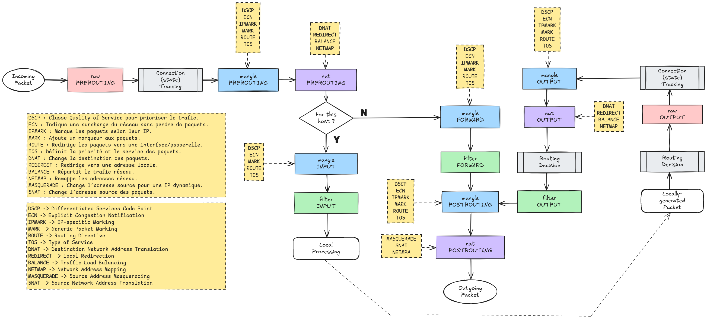

[⬅️ Sommaire](../README.md)

## Schéma de la vie d'un paquet

| Etape | Description |
| --- | --- |
| PREROUTING | Traite les paquets à leur arrivée. Si un paquet est à destination du système local, il sera traité par un processus local ( INPUT, OUTPUT). Sinon et si le FORWARDING est activé, les règles FORWARD et POSTROUTING seront appliquées.|
| FORWARD | Les paquets ne font que traverser le système local. Traite les paquets routés à travers le système local. |
| INPUT | Traite les paquets destinés au système local, en entrée (après le routage) |
| OUTPUT | Traite les paquets quittant le système local, avant le POSTROUTING |
| POSTROUTING | Traite les paquets juste avant leur sortie du système. |

